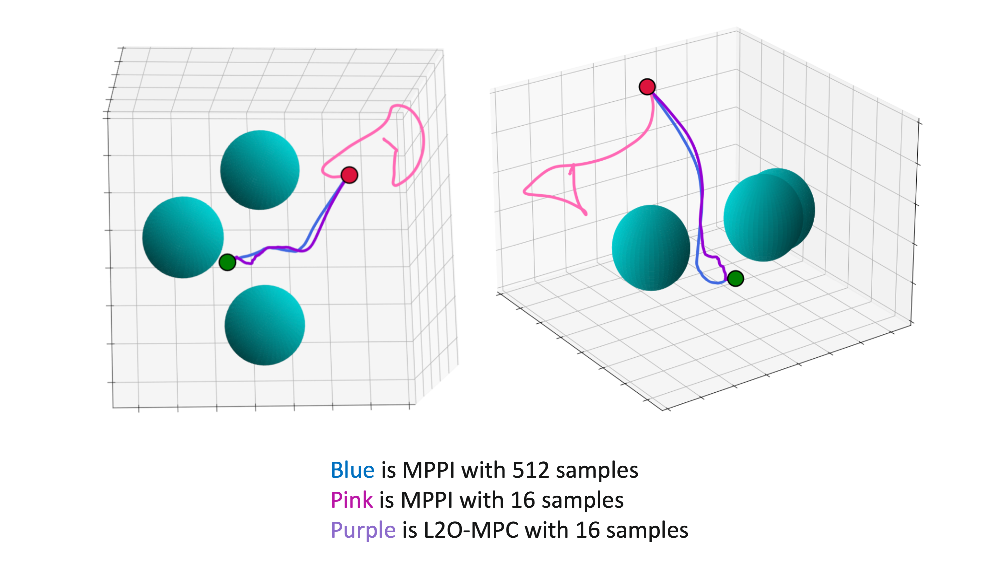
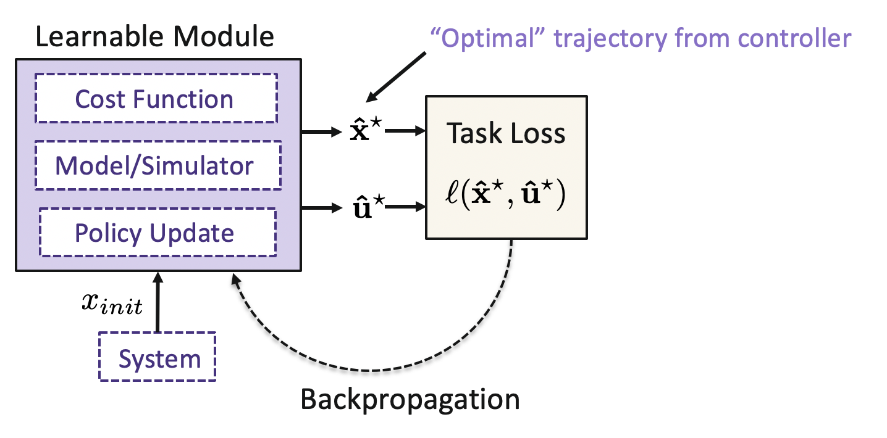

 
 
 
**Learning Sampling Distributions for Model Predictive Control**
 
Conference on Robot Learning (CoRL), 2022
 <b>J. Sacks</b>, B. Boots
<a href="https://proceedings.mlr.press/v205/sacks23a.html">[Proceedings]</a>
<a href="https://arxiv.org/abs/2212.02587" target="_blank" rel="noopener noreferrer">[Arxiv]</a>
<a href="../files/nfmpc_poster.gif">[Poster]</a>

 
 

 
<b>Abstract:</b> Sampling-based methods have become a cornerstone of contemporary approaches to Model Predictive Control (MPC), as they make no restrictions on the differentiability of the dynamics or cost function and are straightforward to parallelize. However, their efficacy is highly dependent on the quality of the sampling distribution itself, which is often assumed to be simple, like a Gaussian. This restriction can result in samples which are far from optimal, leading to poor performance. Recent work has explored improving the performance of MPC by sampling in a learned latent space of controls. However, these methods ultimately perform all MPC parameter updates and warm-starting between time steps in the control space. This requires us to rely on a number of heuristics for generating samples and updating the distribution and may lead to sub-optimal performance. Instead, we propose to carry out all operations in the latent space, allowing us to take full advantage of the learned distribution. Specifically, we frame the learning problem as bi-level optimization and show how to train the controller with backpropagation-through-time. By using a normalizing flow parameterization of the distribution, we can leverage its tractable density to avoid requiring differentiability of the dynamics and cost function. Finally, we evaluate the proposed approach on simulated robotics tasks and demonstrate its ability to surpass the performance of prior methods and scale better with a reduced number of samples.

-----

 
 
 
**Learning to Optimize in Model Predictive Control**
 
International Conference on Robotics and Automation (ICRA), 2022
 <b>J. Sacks</b>, B. Boots
<a href="https://ieeexplore.ieee.org/abstract/document/9812369">[Proceedings]</a>
<a href="https://arxiv.org/abs/2212.02603" target="_blank" rel="noopener noreferrer">[Arxiv]</a>
<a href="../files/l2o_mpc_poster.png">[Poster]</a>

 
 

 
<b>Abstract:</b> Sampling-based Model Predictive Control (MPC) is a flexible control framework that can reason about nonsmooth dynamics and cost functions. Recently, significant work has focused on the use of machine learning to improve the performance of MPC, often through learning or fine-tuning the dynamics or cost function. In contrast, we focus on learning to optimize more effectively. In other words, to improve the update rule within MPC. We show that this can be particularly useful in sampling-based MPC, where we often wish to minimize the number of samples for computational reasons. Unfortunately, the cost of computational efficiency is a reduction in performance; fewer samples results in noisier updates. We show that we can contend with this noise by learning how to update the control distribution more effectively and make better use of the few samples that we have. Our learned controllers are trained via imitation learning to mimic an expert which has access to substantially more samples. We test the efficacy of our approach on multiple simulated robotics tasks in sampleconstrained regimes and demonstrate that our approach can outperform a MPC controller with the same number of samples.

-----

 

**An Online Learning Approach to Model Predictive Control**
 
Robotics: Science and Systems (RSS), 2019
 N. Wagener, C. Cheng, <b>J. Sacks</b>, B. Boots
<b>(Winner of Best Student Paper & Finalist for Best Systems Paper)</b>
<a href="http://roboticsproceedings.org/rss15/p33.pdf">[Proceedings]</a>
<a href="https://arxiv.org/abs/1902.08967" target="_blank" rel="noopener noreferrer">[Arxiv]</a>

 
<b>Abstract:</b> Model predictive control (MPC) is a powerful technique for solving dynamic control tasks. In this paper, we show that there exists a close connection between MPC and online learning, an abstract theoretical framework for analyzing online decision making in the optimization literature. This new perspective provides a foundation for leveraging powerful online learning algorithms to design MPC algorithms. Specifically, we propose a new algorithm based on dynamic mirror descent (DMD), an online learning algorithm that is designed for non-stationary setups. Our algorithm, Dynamic Mirror Descent Model Predictive Control (DMD-MPC), represents a general family of MPC algorithms that includes many existing techniques as special instances. DMD-MPC also provides a fresh perspective on previous heuristics used in MPC and suggests a principled way to design new MPC algorithms. In the experimental section of this paper, we demonstrate the flexibility of DMD-MPC, presenting a set of new MPC algorithms on a simple simulated cartpole and a simulated and real-world aggressive driving task. Videos of the real-world experiments can be found <a href="https://youtu.be/vZST3v0_S9w"> here</a> and <a href="https://youtu.be/MhuqiHo2t98">here</a>.

-----

 
 
**Differentiable MPC for End-to-End Planning and Control**
 
Neural Information Processing Systems (NeurIPS), 2018
 B. Amos, I. D. Jimenez Rodriguez, <b>J. Sacks</b>, B. Boots, J. Z. Kolter
<a href="https://proceedings.neurips.cc/paper/2018/hash/ba6d843eb4251a4526ce65d1807a9309-Abstract.html">[Proceedings]</a>
<a href="https://arxiv.org/abs/1810.13400" target="_blank" rel="noopener noreferrer">[Arxiv]</a>

 

 
<b>Abstract:</b> We present foundations for using Model Predictive Control (MPC) as a differentiable policy class for reinforcement learning. This provides one way of leveraging and combining the advantages of model-free and model-based approaches. Specifically, we differentiate through MPC by using the KKT conditions of the convex approximation at a fixed point of the controller. Using this strategy, we are able to learn the cost and dynamics of a controller via end-to-end learning. Our experiments focus on imitation learning in the pendulum and cartpole domains, where we learn the cost and dynamics terms of an MPC policy class. We show that our MPC policies are significantly more data-efficient than a generic neural network and that our method is superior to traditional system identification in a setting where the expert is unrealizable.

 

